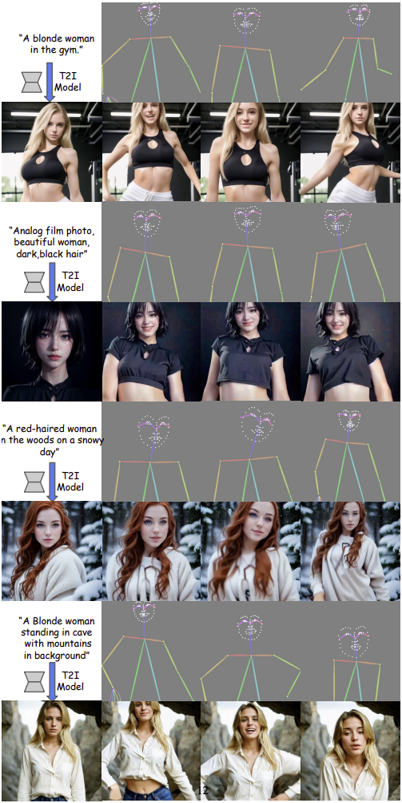
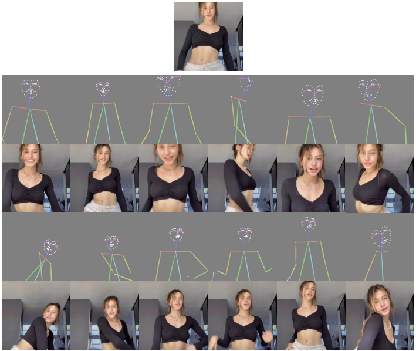

  <h2 align="center">Team 14- MagicPose: Realistic Human Poses <br> and Facial Expressions Retargeting with Identity-aware Diffusion</h2>

  Contributors : Harika Siripurapu, Bhargav Chowdary Rayidi, Sai Vijaya Lakshmi Manne, Madhavi Indukuri
  
   ## About

MagicPose is a diffusion-based model designed for human pose and facial expression retargeting. Its goal is to modify a person's pose and facial expression in an image while maintaining their identity, including facial features, skin tone, and clothing. By leveraging ControlNet and advanced deep learning techniques, the project seeks to maintain the fidelity of the original image while accurately adapting the desired pose. 
    


## Getting Started 
For inference on TikTok dataset or use your own image and poses.

The pre-processed TikTok dataset can be downloaded from [here](https://drive.google.com/file/d/1jEK0YJ5AfZZuFNqGGqOtUPFx--TIebT9/view?usp=sharing). OpenPose may fail to detect human pose skeletons for some images, so we will filter those failure cases and train our model on clean data.

Place the pretrained weights and dataset as following:
```bash
MagicDance
|----TikTok-v4
|----pretrained_weights
  |----control_v11p_sd15_openpose.pth
  |----control_sd15_ini.ckpt
  |----model_state-110000.th
  |----model_state-10000.th  
|----...
```

## Environment
The environment from my machine is `python==3.9`, `pytorch==1.13.1`, `CUDA==11.7`. You may use other version of these prerequisites according to your local environment.
```bash
conda env create -f environment.yaml
conda activate magicpose
```
### Inference with your own image and pose sequence:
```bash
bash scripts/inference_any_image_pose.sh
```
We offer some images and poses in "example_data", you can easily inference with your own image or pose sequence by replacing the arguments "local_cond_image_path" and "local_pose_path" in inference_any_image_pose.sh. Some interesting outputs from out-of-domain images are shown below:
<div align="center">
  
</div>
Our model is also able to retarget the pose of generated image from T2I model.
<div align="center">
  
</div>


## Inference 
### Inference on the test set:
```bash
bash scripts/inference_tiktok_dataset.sh
```

<div align="center">
  
</div>
<br>


## Training
Appearance Control Pretraining:
```bash
bash scripts/appearance_control_pretraining.sh
```

Appearance-Disentangled Pose Control:
```bash
bash scripts/appearance_disentangle_pose_control.sh
```


## Using your own video data for training 
For training on your own dataset, you first need to run [openpose](https://github.com/CMU-Perceptual-Computing-Lab/openpose) for your input images/videos and save the visualized pose map. Then, organize them as the format shown in the TikTok dataset. You can also refer to [DisCo-OpenPose Preprocessing](https://github.com/Wangt-CN/DisCo/blob/main/PREPRO.md#openpose) or [ControlNet-OpenPose](https://github.com/lllyasviel/ControlNet-v1-1-nightly?tab=readme-ov-file#controlnet-11-openpose), we use exactly the same Pose ControlNet in our pipeline.
Then set the path to your data in [dataset/tiktok_video_arnold_copy.py](https://github.com/Boese0601/MagicDance/blob/main/dataset/tiktok_video_arnold_copy.py#L287)

```bash
Your Dataset
|----train_set
  |----video_000
    |----000.jpg
    |----001.jpg
    |----002.jpg
    ...
  |----video_001
  |----video_002
  ...
|----pose_map_train_set
  |----video_000
    |----000.jpg
    |----001.jpg
    |----002.jpg
    ...
  |----video_001
  |----video_002
  ...
|----val_set
|----pose_map_val_set
|----test_set
|----pose_map_test_set
|----...
```


## Some tips
### The task
From our experiences with this project, this motion retargeting task is a data-hungry task. Generation result highly depends on the training data. You may consider adopt [DensePose](https://arxiv.org/abs/1802.00434) as in [MagicAnimate](https://arxiv.org/abs/2311.16498), [DWPose](https://github.com/IDEA-Research/DWPose) as in [Animate Anyone](https://arxiv.org/pdf/2311.17117.pdf) or any other geometry control for better generation quality. We have tried [MMPose](https://github.com/open-mmlab/mmpose) as well, which produced slightly better pose detection results. Introduce extra training data will yield better performance, consider using any other real-human dataset half-body/full-body dataset, e.g. [TaiChi](https://github.com/AliaksandrSiarohin/first-order-model)/[DeepFashion](https://mmlab.ie.cuhk.edu.hk/projects/DeepFashion.html), for further finetuning.

### The code
Most of the arguments are self-explanatory in the codes. Several key arguments are explained below.

* `model_config` A relative or absolute folder path to the config file of your model architecture.
* `img_bin_limit` The maximum step for randomly selecting source and target image during training. During inference, the value is set to be "all".
* `control_mode` This argument controls the Image-CFG during inference. "controlnet_important" denotes Image-CFG is used and "balance" means not.
* `wonoise` The reference image is fed into the appearance control model without adding noise.
* `with_text` When "with_text" is given, text is **not** used for training. (I know it's a bit confusing, lol)
* `finetune_control` Finetune Appearance Control Model (and Pose ControlNet).
* `output_dir` A relative or absolute folder for writing checkpoints.
* `local_image_dir` A relative or absolute folder  for writing image outputs.
* `image_pretrain_dir` A relative or absolute folder for loading appearance control model checkpoint.
* `pose_pretrain_dir` A relative or absolute path to pose controlnet.


## To run the frontend application

```bash
$ npm run dev
```

This command will create a development server and runs the frontend applicaiton on 5173 port. if you enter o + enter on your key board once after the server starts it automatically open a tab in your default browser for the application.

The application has an input field to upload image for which we want to render the free-viwepoint video. Once we select the image file it send the file to the backend flask server to run the inference. Then the server sends back the output image which will be played in the frotnend application

## magicpose-web-server

This folder contains a backend web server build on Python's Flask framework which accepts the video that is sent from the frontend react application and sends it to run the inference and then then responds with the output image which is a freeview render of the inference's output.

### Backend setup

To setup and run the backend server follow below instructions

```bash
$ cd ./magicpose-web-server
```

if its a windows machine

```bash
$ ./venv/Scripts/activate
```

on a Mac machine

```bash
$ source ./venv/Scripts/activate
```

one the virtual environment is created then run the below command to install all the depencies

```bash
$ pip install -r requirements.txt
```

once all the dependencies are installed, run the app.py file to start a backend server on port 5000 which is a default port for the Flask framework by using the following command

```python
$ python app.py
```

This command will run the backend server on port 5000 which exposes two rest endpoint to accept the input image from the frontend application by using a HTTP multipart formdata request. and it also exposes another HTTP endpoint to stream the output video generate by our ML model back to the frontend. we have used the open cv framework to achieve this feature.


> **_NOTE:_**

    The backend code that is provided here is currently unable to run the inference by itself because in order to do that we need to deploy our backend server on a GPU machine which should atleast be equipped with 4 NVIDIA RTX 2080Ti GPU's. 


## Citing
```BibTeX
@article{chang2023magicdance,
  title={MagicDance: Realistic Human Dance Video Generation with Motions \& Facial Expressions Transfer},
  author={Chang, Di and Shi, Yichun and Gao, Quankai and Fu, Jessica and Xu, Hongyi and Song, Guoxian and Yan, Qing and Yang, Xiao and Soleymani, Mohammad},
  journal={arXiv preprint arXiv:2311.12052},
  year={2023}
}
```


